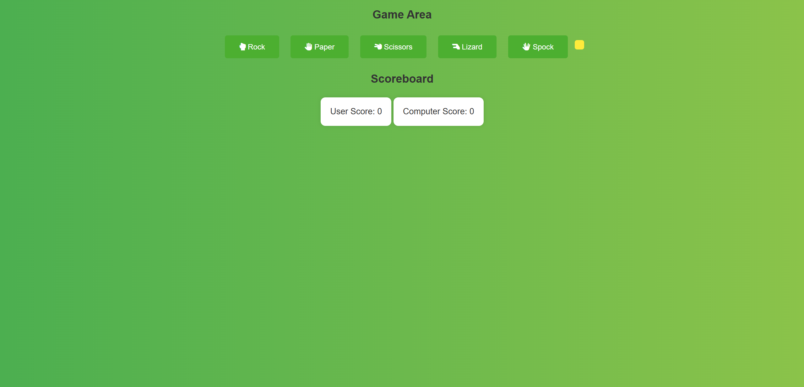

# Project2
# Rock, Paper, Scissors, Lizard, Spock Game

## Project Description
This project is an interactive application that allows users to play the game "Rock, Paper, Scissors, Lizard, Spock". It includes score tracking and provides visual feedback for game results.

## Features
- User-friendly interface with buttons for each choice
- Score tracking for user and computer
- Visual feedback for game results

## Usage
1. Clone the repository: `git clone <repository-url>`
2. Open `index.html` in your preferred browser

## Deployment
The application is deployed on GitHub Pages. Visit [this link to access the app](https://<your-username>.github.io/<repository-name>)

## External Resources
- **Font Awesome:** Icons used in the buttons are provided by [Font Awesome](https://fontawesome.com/)
- **Freesound:** Sound effects used in the game are sourced from [Freesound](https://freesound.org/)

## Screenshots

## License
This project is licensed under the MIT License. See the `LICENSE` file for details.
